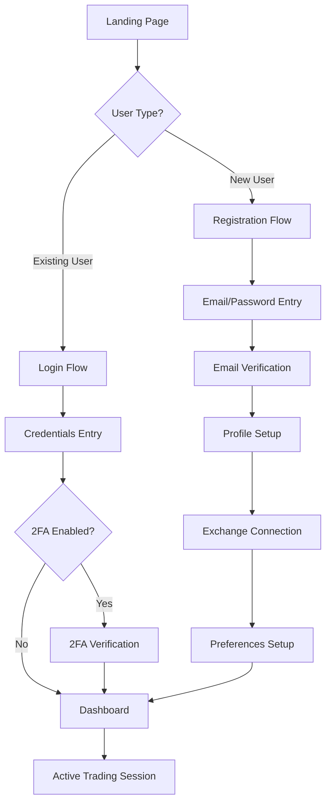

# 🚀 Zmarty Complete Onboarding Flow Documentation

## Table of Contents
1. [Overview](#overview)
2. [User Journey Map](#user-journey-map)
3. [Slide-by-Slide Implementation](#slide-by-slide-implementation)
4. [User Flow Scenarios](#user-flow-scenarios)
5. [Error Handling](#error-handling)
6. [Post-Onboarding](#post-onboarding)

---

## Overview

**Product**: Zmarty - AI-Powered Crypto Trading Assistant
**Objective**: Seamless onboarding from first visit to active user dashboard
**Duration**: 2-3 minutes average completion time
**Success Metric**: User successfully creates account, verifies email, and accesses dashboard

### Technical Stack
- **Frontend**: HTML5, CSS3, JavaScript (ES6+)
- **Backend**: Supabase (ZmartyBrain for auth, Smart Trading for data)
- **Email**: Custom SMTP via Gmail
- **AI Models**: Claude, GPT-5, Gemini, Grok
- **Real-time Data**: 100+ crypto exchanges integration

---

## User Journey Map



---

## Slide-by-Slide Implementation

### 🎯 Slide 1: Welcome Landing
**Title**: Welcome to Zmarty
**Subtitle**: Your AI Trading Companion
**Description**: Experience advanced crypto tools with our intelligent assistant that works 24/7 to keep you connected with market changes.

**Key Features Display**:
- 🧠 Smart - AI-driven insights
- ⚡ Adaptive - Real-time adjustments
- ✨ Organized - Portfolio management
- 🎯 Precise - Accurate predictions

**CTA**: "Get Started" / "Sign In"

**Code Implementation**:
```html
<!-- Slide 1: Welcome Landing -->
<div class="slide slide-welcome active" id="slide-1">
    <div class="content-wrapper">
        <div class="logo-section">
            <h1 class="main-title">
                <span class="logo-icon">🚀</span> Zmarty
            </h1>
            <p class="tagline">Your AI Trading Companion</p>
        </div>

        <p class="description">
            Experience advanced crypto tools with our intelligent assistant
            that works 24/7 to keep you connected with market changes.
        </p>

        <div class="features-grid">
            <div class="feature-card">
                <span class="feature-icon">🧠</span>
                <h3>Smart</h3>
            </div>
            <div class="feature-card">
                <span class="feature-icon">⚡</span>
                <h3>Adaptive</h3>
            </div>
            <div class="feature-card">
                <span class="feature-icon">✨</span>
                <h3>Organized</h3>
            </div>
            <div class="feature-card">
                <span class="feature-icon">🎯</span>
                <h3>Precise</h3>
            </div>
        </div>

        <div class="tech-stack">
            <p>Powered by advanced AI technology • Multi LLM System</p>
        </div>

        <div class="cta-buttons">
            <button class="btn-primary" onclick="moveToSlide(2)">
                Get Started →
            </button>
            <button class="btn-secondary" onclick="showLogin()">
                Sign In
            </button>
        </div>
    </div>
</div>
```

---

### 🤖 Slide 2: AI Detection Power
**Title**: AI Detection Power
**Description**: Four powerful AI models working together for superior insights

**Models Showcase**:
- Claude (Anthropic)
- GPT-5 (OpenAI)
- Gemini (Google)
- Grok (xAI)

**Code Implementation**:
```html
<!-- Slide 2: AI Power Showcase -->
<div class="slide slide-ai-power" id="slide-2">
    <div class="content-wrapper">
        <h2 class="slide-title">AI Detection Power</h2>
        <p class="slide-subtitle">
            Four powerful AI models working together for superior insights,
            giving Zmarty the ability to act geniously.
        </p>

        <div class="ai-models-grid">
            <div class="ai-model-card claude">
                <div class="model-icon">
                    
                </div>
                <h3>Claude</h3>
                <p>Advanced reasoning</p>
            </div>

            <div class="ai-model-card gpt">
                <div class="model-icon">
                    
                </div>
                <h3>GPT-5</h3>
                <p>Market analysis</p>
            </div>

            <div class="ai-model-card gemini">
                <div class="model-icon">
                    
                </div>
                <h3>Gemini</h3>
                <p>Pattern recognition</p>
            </div>

            <div class="ai-model-card grok">
                <div class="model-icon">
                    
                </div>
                <h3>Grok</h3>
                <p>Social sentiment</p>
            </div>
        </div>

        <div class="ai-capabilities">
            <div class="capability-item">
                <span class="check-icon">✓</span>
                Real-time analysis across all models
            </div>
            <div class="capability-item">
                <span class="check-icon">✓</span>
                Crypto Portfolio optimization
            </div>
        </div>

        <button class="btn-primary" onclick="moveToSlide(3)">
            Continue →
        </button>
    </div>
</div>
```

---

### 📊 Slide 3: Track Everything
**Title**: Track Everything
**Description**: Real-time monitoring across all major exchanges

**Features**:
- 🚦 Live Data - 100+ exchanges
- 🎯 Smart Alerts - AI-powered signals
- 💼 Analytics - P&L tracking
- 🔔 24/7 Watch - Never miss trades

**Code Implementation**:
```html
<!-- Slide 3: Track Everything -->
<div class="slide slide-tracking" id="slide-3">
    <div class="content-wrapper">
        <h2 class="slide-title">Track Everything</h2>
        <p class="slide-subtitle">
            Real-time monitoring across all major exchanges. Technical indicators,
            liquidation clusters, risk metrics, on-chain movements. Zmarty knows everything.
        </p>

        <div class="tracking-features">
            <div class="tracking-card">
                <div class="card-header">
                    <span class="card-icon">🚦</span>
                    <h3>Live Data</h3>
                </div>
                <p>100+ exchanges</p>
            </div>

            <div class="tracking-card">
                <div class="card-header">
                    <span class="card-icon">🎯</span>
                    <h3>Smart Alerts</h3>
                </div>
                <p>AI-powered signals</p>
            </div>

            <div class="tracking-card">
                <div class="card-header">
                    <span class="card-icon">💼</span>
                    <h3>Analytics</h3>
                </div>
                <p>P&L tracking</p>
            </div>

            <div class="tracking-card">
                <div class="card-header">
                    <span class="card-icon">🔔</span>
                    <h3>24/7 Watch</h3>
                </div>
                <p>Never miss trades</p>
            </div>
        </div>

        <div class="exchange-logos">
            
            
            
            
            <span class="more-exchanges">+96 more</span>
        </div>

        <button class="btn-primary" onclick="moveToSlide(4)">
            Get Started →
        </button>
    </div>
</div>
```

---

### 📝 Slide 4: Registration/Login
**Title**: Join Zmarty Today
**Description**: Sign up in seconds with your favorite platform

**Options**:
1. Social Login (Google, Apple)
2. Email Registration
3. Existing User Login

**Code Implementation**:
```html
<!-- Slide 4: Registration/Login -->
<div class="slide slide-auth" id="slide-4">
    <div class="content-wrapper">
        <h2 class="slide-title">Join Zmarty Today</h2>
        <p class="slide-subtitle">Sign up in seconds with your favorite platform</p>

        <div class="auth-container">
            <!-- Social Login Options -->
            <div class="social-auth">
                <button class="social-btn google" onclick="signInWithGoogle()">
                    
                    Continue with Google
                </button>

                <button class="social-btn apple" onclick="signInWithApple()">
                    
                    Continue with Apple
                </button>
            </div>

            <div class="divider">
                <span>OR</span>
            </div>

            <!-- Email Registration Form -->
            <form id="email-auth-form" class="email-auth">
                <div class="form-group">
                    <input
                        type="email"
                        id="email-input"
                        placeholder="Enter your email"
                        required
                    >
                </div>

                <button type="submit" class="btn-primary">
                    Continue with Email
                </button>
            </form>

            <p class="auth-footer">
                Already have an account?
                <a href="#" onclick="showLoginForm()">Sign in</a>
            </p>
        </div>
    </div>
</div>
```

---

### ✉️ Slide 5: Email Verification
**Title**: Verify Your Email
**Description**: We've sent a verification code to your email

**Features**:
- 6-digit code input
- Resend code option
- Timer countdown
- Auto-verification on correct code

**Code Implementation**:
```html
<!-- Slide 5: Email Verification -->
<div class="slide slide-verification" id="slide-5">
    <div class="content-wrapper">
        <div class="verification-header">
            <div class="email-icon">✉️</div>
            <h2>Verify Your Email</h2>
            <p>We've sent a verification code to:</p>
            <p class="user-email" id="verification-email">user@example.com</p>
        </div>

        <div class="verification-form">
            <div class="code-inputs">
                <input type="text" maxlength="1" class="code-input" data-index="0">
                <input type="text" maxlength="1" class="code-input" data-index="1">
                <input type="text" maxlength="1" class="code-input" data-index="2">
                <input type="text" maxlength="1" class="code-input" data-index="3">
                <input type="text" maxlength="1" class="code-input" data-index="4">
                <input type="text" maxlength="1" class="code-input" data-index="5">
            </div>

            <div class="verification-status" id="verification-status"></div>

            <div class="resend-section">
                <p class="timer-text">
                    Didn't receive the code?
                    <span id="resend-timer">Wait 60s</span>
                </p>
                <button
                    class="btn-link"
                    id="resend-btn"
                    onclick="resendVerificationCode()"
                    disabled
                >
                    Resend Code
                </button>
            </div>

            <button class="btn-primary" onclick="verifyCode()">
                Verify Email
            </button>
        </div>
    </div>
</div>
```

---

### 🔐 Slide 6: Password Setup
**Title**: Create Your Password
**Description**: Secure your account with a strong password

**Requirements**:
- Minimum 8 characters
- One uppercase letter
- One number
- One special character
- Password strength meter

**Code Implementation**:
```html
<!-- Slide 6: Password Setup -->
<div class="slide slide-password" id="slide-6">
    <div class="content-wrapper">
        <h2 class="slide-title">Create Your Password</h2>
        <p class="slide-subtitle">Secure your account with a strong password</p>

        <form id="password-form" class="password-setup">
            <div class="form-group">
                <label for="password">Password</label>
                <div class="password-input-wrapper">
                    <input
                        type="password"
                        id="password"
                        placeholder="Enter password"
                        required
                    >
                    <button type="button" class="toggle-password" onclick="togglePassword('password')">
                        👁️
                    </button>
                </div>
            </div>

            <div class="password-strength">
                <div class="strength-meter">
                    <div class="strength-bar" id="strength-bar"></div>
                </div>
                <span class="strength-text" id="strength-text">Enter password</span>
            </div>

            <div class="password-requirements">
                <div class="requirement" id="req-length">
                    <span class="req-icon">○</span> At least 8 characters
                </div>
                <div class="requirement" id="req-uppercase">
                    <span class="req-icon">○</span> One uppercase letter
                </div>
                <div class="requirement" id="req-number">
                    <span class="req-icon">○</span> One number
                </div>
                <div class="requirement" id="req-special">
                    <span class="req-icon">○</span> One special character
                </div>
            </div>

            <div class="form-group">
                <label for="confirm-password">Confirm Password</label>
                <div class="password-input-wrapper">
                    <input
                        type="password"
                        id="confirm-password"
                        placeholder="Confirm password"
                        required
                    >
                    <button type="button" class="toggle-password" onclick="togglePassword('confirm-password')">
                        👁️
                    </button>
                </div>
            </div>

            <button type="submit" class="btn-primary">
                Continue →
            </button>
        </form>
    </div>
</div>
```

---

### 👤 Slide 7: Profile Setup
**Title**: Complete Your Profile
**Description**: Tell us a bit about yourself

**Fields**:
- Full Name
- Trading Experience Level
- Preferred Trading Pairs
- Risk Tolerance
- Notification Preferences

**Code Implementation**:
```html
<!-- Slide 7: Profile Setup -->
<div class="slide slide-profile" id="slide-7">
    <div class="content-wrapper">
        <h2 class="slide-title">Complete Your Profile</h2>
        <p class="slide-subtitle">Tell us a bit about yourself</p>

        <form id="profile-form" class="profile-setup">
            <div class="form-group">
                <label for="full-name">Full Name</label>
                <input
                    type="text"
                    id="full-name"
                    placeholder="John Doe"
                    required
                >
            </div>

            <div class="form-group">
                <label for="experience">Trading Experience</label>
                <select id="experience" required>
                    <option value="">Select your experience level</option>
                    <option value="beginner">Beginner (< 1 year)</option>
                    <option value="intermediate">Intermediate (1-3 years)</option>
                    <option value="advanced">Advanced (3-5 years)</option>
                    <option value="expert">Expert (5+ years)</option>
                </select>
            </div>

            <div class="form-group">
                <label>Preferred Trading Pairs</label>
                <div class="checkbox-group">
                    <label class="checkbox-label">
                        <input type="checkbox" value="BTC/USDT" checked>
                        BTC/USDT
                    </label>
                    <label class="checkbox-label">
                        <input type="checkbox" value="ETH/USDT">
                        ETH/USDT
                    </label>
                    <label class="checkbox-label">
                        <input type="checkbox" value="SOL/USDT">
                        SOL/USDT
                    </label>
                    <label class="checkbox-label">
                        <input type="checkbox" value="other">
                        Other Altcoins
                    </label>
                </div>
            </div>

            <div class="form-group">
                <label for="risk-tolerance">Risk Tolerance</label>
                <div class="risk-slider">
                    <input
                        type="range"
                        id="risk-tolerance"
                        min="1"
                        max="5"
                        value="3"
                    >
                    <div class="risk-labels">
                        <span>Conservative</span>
                        <span>Balanced</span>
                        <span>Aggressive</span>
                    </div>
                </div>
            </div>

            <div class="form-group">
                <label>Notification Preferences</label>
                <div class="checkbox-group">
                    <label class="checkbox-label">
                        <input type="checkbox" value="price-alerts" checked>
                        Price Alerts
                    </label>
                    <label class="checkbox-label">
                        <input type="checkbox" value="trading-signals" checked>
                        Trading Signals
                    </label>
                    <label class="checkbox-label">
                        <input type="checkbox" value="portfolio-updates">
                        Portfolio Updates
                    </label>
                    <label class="checkbox-label">
                        <input type="checkbox" value="market-news">
                        Market News
                    </label>
                </div>
            </div>

            <button type="submit" class="btn-primary">
                Continue →
            </button>
        </form>
    </div>
</div>
```

---

### 🔗 Slide 8: Exchange Connection (Optional)
**Title**: Connect Your Exchanges
**Description**: Link your trading accounts for automated tracking

**Supported Exchanges**:
- Binance
- Coinbase Pro
- Kraken
- Bybit
- KuCoin
- And more...

**Code Implementation**:
```html
<!-- Slide 8: Exchange Connection -->
<div class="slide slide-exchanges" id="slide-8">
    <div class="content-wrapper">
        <h2 class="slide-title">Connect Your Exchanges</h2>
        <p class="slide-subtitle">Link your trading accounts for automated tracking</p>

        <div class="exchange-list">
            <div class="exchange-card" onclick="connectExchange('binance')">
                
                <h3>Binance</h3>
                <span class="status disconnected">Connect</span>
            </div>

            <div class="exchange-card" onclick="connectExchange('coinbase')">
                
                <h3>Coinbase Pro</h3>
                <span class="status disconnected">Connect</span>
            </div>

            <div class="exchange-card" onclick="connectExchange('kraken')">
                
                <h3>Kraken</h3>
                <span class="status disconnected">Connect</span>
            </div>

            <div class="exchange-card" onclick="connectExchange('bybit')">
                
                <h3>Bybit</h3>
                <span class="status disconnected">Connect</span>
            </div>
        </div>

        <div class="api-notice">
            <span class="info-icon">ℹ️</span>
            <p>We only use read-only API access. Your funds are always safe.</p>
        </div>

        <div class="action-buttons">
            <button class="btn-secondary" onclick="skipExchangeSetup()">
                Skip for Now
            </button>
            <button class="btn-primary" onclick="moveToSlide(9)">
                Continue →
            </button>
        </div>
    </div>
</div>
```

---

### ✅ Slide 9: Onboarding Complete
**Title**: Welcome to Zmarty!
**Description**: Your account is ready

**Options**:
- Start Tutorial
- Go to Dashboard
- Explore Features

**Code Implementation**:
```html
<!-- Slide 9: Onboarding Complete -->
<div class="slide slide-complete" id="slide-9">
    <div class="content-wrapper">
        <div class="success-animation">
            <div class="checkmark-circle">✓</div>
        </div>

        <h2 class="slide-title">Welcome to Zmarty!</h2>
        <p class="slide-subtitle">Your account is ready</p>

        <div class="completion-stats">
            <div class="stat-item">
                <span class="stat-icon">👤</span>
                <p>Profile Complete</p>
            </div>
            <div class="stat-item">
                <span class="stat-icon">✉️</span>
                <p>Email Verified</p>
            </div>
            <div class="stat-item">
                <span class="stat-icon">🔐</span>
                <p>Account Secured</p>
            </div>
        </div>

        <div class="next-steps">
            <h3>What would you like to do first?</h3>

            <div class="option-cards">
                <div class="option-card" onclick="startTutorial()">
                    <span class="option-icon">📚</span>
                    <h4>Take a Tour</h4>
                    <p>2-minute guided tutorial</p>
                </div>

                <div class="option-card" onclick="goToDashboard()">
                    <span class="option-icon">📊</span>
                    <h4>Dashboard</h4>
                    <p>Start trading now</p>
                </div>

                <div class="option-card" onclick="exploreFeatures()">
                    <span class="option-icon">🚀</span>
                    <h4>Explore</h4>
                    <p>Discover features</p>
                </div>
            </div>
        </div>

        <button class="btn-primary large" onclick="goToDashboard()">
            Go to Dashboard →
        </button>
    </div>
</div>
```

---

## User Flow Scenarios

### Scenario 1: New User - Email Registration
```javascript
// New User Registration Flow
async function handleNewUserFlow(email) {
    // Step 1: Check if email exists
    const userExists = await checkUserExists(email);

    if (userExists) {
        // Redirect to login
        showLoginForm(email);
        return;
    }

    // Step 2: Create account
    const { user, error } = await supabase.auth.signUp({
        email: email,
        password: password,
        options: {
            emailRedirectTo: 'http://localhost:8083/verify'
        }
    });

    // Step 3: Send verification email
    if (user) {
        moveToSlide(5); // Verification slide
        startVerificationTimer();
    }
}
```

### Scenario 2: Existing User - Login
```javascript
// Existing User Login Flow
async function handleExistingUserFlow(email, password) {
    // Step 1: Attempt login
    const { user, error } = await supabase.auth.signInWithPassword({
        email: email,
        password: password
    });

    if (error) {
        if (error.message.includes('Email not confirmed')) {
            // Resend verification
            resendVerificationCode(email);
            moveToSlide(5);
        } else if (error.message.includes('Invalid login')) {
            showError('Invalid email or password');
        }
        return;
    }

    // Step 2: Check profile completion
    const profile = await getUserProfile(user.id);

    if (!profile.completed) {
        moveToSlide(7); // Profile setup
    } else {
        goToDashboard();
    }
}
```

### Scenario 3: Social Login
```javascript
// Social Login Flow
async function handleSocialLogin(provider) {
    const { user, error } = await supabase.auth.signInWithOAuth({
        provider: provider, // 'google' or 'apple'
        options: {
            redirectTo: 'http://localhost:8083/auth/callback'
        }
    });

    if (user) {
        // Check if first time user
        const isNewUser = await checkIfNewUser(user.id);

        if (isNewUser) {
            moveToSlide(7); // Profile setup
        } else {
            goToDashboard();
        }
    }
}
```

### Scenario 4: Password Reset
```javascript
// Password Reset Flow
async function handlePasswordReset(email) {
    const { error } = await supabase.auth.resetPasswordForEmail(email, {
        redirectTo: 'http://localhost:8083/reset-password'
    });

    if (!error) {
        showMessage('Password reset email sent. Check your inbox.');
    }
}
```

---

## Error Handling

### Common Error States

```javascript
const errorHandlers = {
    // Rate limiting
    'rate_limit': {
        message: 'Too many attempts. Please wait before trying again.',
        action: () => showRateLimitTimer()
    },

    // Invalid credentials
    'invalid_credentials': {
        message: 'Invalid email or password. Please try again.',
        action: () => highlightErrorFields(['email', 'password'])
    },

    // Email not verified
    'email_not_confirmed': {
        message: 'Please verify your email first.',
        action: () => {
            moveToSlide(5);
            resendVerificationCode();
        }
    },

    // Network error
    'network_error': {
        message: 'Connection error. Please check your internet.',
        action: () => showRetryButton()
    },

    // User already exists
    'user_already_exists': {
        message: 'An account with this email already exists.',
        action: () => showLoginOption()
    }
};

// Global error handler
function handleError(error) {
    const handler = errorHandlers[error.code] || {
        message: 'Something went wrong. Please try again.',
        action: () => console.error(error)
    };

    showError(handler.message);
    handler.action();
}
```

---

## Post-Onboarding

### Dashboard Entry Point
```javascript
// Dashboard Initialization
async function initializeDashboard() {
    // 1. Load user data
    const user = await getCurrentUser();
    const profile = await getUserProfile(user.id);
    const preferences = await getUserPreferences(user.id);

    // 2. Initialize WebSocket connections
    initializeWebSocket();
    subscribeToMarketData(preferences.trading_pairs);

    // 3. Load portfolio data
    const portfolio = await getPortfolioData(user.id);
    renderPortfolio(portfolio);

    // 4. Start AI assistants
    initializeAIAssistants({
        models: ['claude', 'gpt5', 'gemini', 'grok'],
        user_preferences: preferences
    });

    // 5. Set up notifications
    setupNotifications(preferences.notifications);

    // 6. Show welcome message if first time
    if (profile.first_login) {
        showWelcomeModal();
        markFirstLoginComplete(user.id);
    }

    // 7. Check for any pending actions
    const pendingActions = await getPendingActions(user.id);
    if (pendingActions.length > 0) {
        showPendingActionsBar(pendingActions);
    }
}

// Dashboard HTML Structure
```

```html
<!DOCTYPE html>
<html lang="en">
<head>
    <meta charset="UTF-8">
    <meta name="viewport" content="width=device-width, initial-scale=1.0">
    <title>Zmarty Dashboard - AI Trading Assistant</title>
    <link rel="stylesheet" href="/css/dashboard.css">
</head>
<body>
    <!-- Main Dashboard Container -->
    <div id="dashboard-app">
        <!-- Sidebar Navigation -->
        <aside class="sidebar">
            <div class="sidebar-header">
                <div class="logo">
                    <span class="logo-icon">🚀</span>
                    <span class="logo-text">Zmarty</span>
                </div>
            </div>

            <nav class="sidebar-nav">
                <a href="#overview" class="nav-item active">
                    <span class="nav-icon">📊</span>
                    <span class="nav-text">Overview</span>
                </a>
                <a href="#portfolio" class="nav-item">
                    <span class="nav-icon">💼</span>
                    <span class="nav-text">Portfolio</span>
                </a>
                <a href="#trading" class="nav-item">
                    <span class="nav-icon">📈</span>
                    <span class="nav-text">Trading</span>
                </a>
                <a href="#signals" class="nav-item">
                    <span class="nav-icon">🎯</span>
                    <span class="nav-text">AI Signals</span>
                </a>
                <a href="#alerts" class="nav-item">
                    <span class="nav-icon">🔔</span>
                    <span class="nav-text">Alerts</span>
                </a>
            </nav>
        </aside>

        <!-- Main Content Area -->
        <main class="main-content">
            <!-- Top Bar -->
            <header class="top-bar">
                <div class="search-bar">
                    <input type="text" placeholder="Search coins, signals...">
                </div>

                <div class="top-bar-actions">
                    <button class="notification-btn">
                        <span class="notification-icon">🔔</span>
                        <span class="notification-badge">3</span>
                    </button>

                    <div class="user-menu">
                        
                        <span class="user-name">John Doe</span>
                    </div>
                </div>
            </header>

            <!-- Dashboard Content -->
            <div class="dashboard-content">
                <!-- Welcome Section -->
                <section class="welcome-section">
                    <h1>Welcome back, John! 👋</h1>
                    <p>Here's what's happening with your crypto portfolio today.</p>
                </section>

                <!-- Stats Cards -->
                <div class="stats-grid">
                    <div class="stat-card">
                        <div class="stat-header">
                            <span class="stat-label">Total Balance</span>
                            <span class="stat-change positive">+12.5%</span>
                        </div>
                        <div class="stat-value">$45,231.89</div>
                    </div>

                    <div class="stat-card">
                        <div class="stat-header">
                            <span class="stat-label">Today's P&L</span>
                            <span class="stat-change positive">+$2,341.12</span>
                        </div>
                        <div class="stat-value positive">+5.46%</div>
                    </div>

                    <div class="stat-card">
                        <div class="stat-header">
                            <span class="stat-label">Active Trades</span>
                            <span class="stat-badge">Live</span>
                        </div>
                        <div class="stat-value">7</div>
                    </div>

                    <div class="stat-card">
                        <div class="stat-header">
                            <span class="stat-label">AI Confidence</span>
                            <span class="stat-indicator high">High</span>
                        </div>
                        <div class="stat-value">94%</div>
                    </div>
                </div>

                <!-- Main Dashboard Sections -->
                <div class="dashboard-grid">
                    <!-- Portfolio Chart -->
                    <div class="dashboard-card chart-card">
                        <div class="card-header">
                            <h2>Portfolio Performance</h2>
                            <div class="time-selector">
                                <button class="time-btn">1D</button>
                                <button class="time-btn active">1W</button>
                                <button class="time-btn">1M</button>
                                <button class="time-btn">1Y</button>
                            </div>
                        </div>
                        <div class="chart-container">
                            <canvas id="portfolio-chart"></canvas>
                        </div>
                    </div>

                    <!-- AI Signals -->
                    <div class="dashboard-card signals-card">
                        <div class="card-header">
                            <h2>AI Trading Signals</h2>
                            <button class="view-all-btn">View All</button>
                        </div>
                        <div class="signals-list">
                            <div class="signal-item bullish">
                                <div class="signal-info">
                                    <span class="signal-coin">BTC/USDT</span>
                                    <span class="signal-action">Strong Buy</span>
                                </div>
                                <div class="signal-meta">
                                    <span class="signal-confidence">92%</span>
                                    <span class="signal-time">2 min ago</span>
                                </div>
                            </div>

                            <div class="signal-item bearish">
                                <div class="signal-info">
                                    <span class="signal-coin">SHIB/USDT</span>
                                    <span class="signal-action">Sell</span>
                                </div>
                                <div class="signal-meta">
                                    <span class="signal-confidence">78%</span>
                                    <span class="signal-time">5 min ago</span>
                                </div>
                            </div>
                        </div>
                    </div>

                    <!-- Active Positions -->
                    <div class="dashboard-card positions-card">
                        <div class="card-header">
                            <h2>Active Positions</h2>
                            <button class="manage-btn">Manage</button>
                        </div>
                        <div class="positions-table">
                            <table>
                                <thead>
                                    <tr>
                                        <th>Coin</th>
                                        <th>Amount</th>
                                        <th>Entry</th>
                                        <th>Current</th>
                                        <th>P&L</th>
                                    </tr>
                                </thead>
                                <tbody id="positions-tbody">
                                    <!-- Dynamic content -->
                                </tbody>
                            </table>
                        </div>
                    </div>
                </div>
            </div>
        </main>

        <!-- AI Assistant Chat -->
        <div class="ai-assistant" id="ai-assistant">
            <div class="assistant-header">
                <span class="assistant-icon">🤖</span>
                <span class="assistant-title">Zmarty AI</span>
                <button class="minimize-btn">−</button>
            </div>
            <div class="assistant-body">
                <div class="chat-messages" id="chat-messages">
                    <div class="message ai-message">
                        <p>Hello! I'm Zmarty, your AI trading assistant. How can I help you today?</p>
                    </div>
                </div>
                <div class="chat-input">
                    <input type="text" placeholder="Ask me anything...">
                    <button class="send-btn">→</button>
                </div>
            </div>
        </div>
    </div>

    <script src="/js/dashboard.js"></script>
</body>
</html>
```

---

## Complete JavaScript Implementation

```javascript
// Complete Onboarding Flow Manager
class OnboardingFlow {
    constructor() {
        this.currentSlide = 1;
        this.totalSlides = 9;
        this.userData = {};
        this.supabase = null;
        this.init();
    }

    async init() {
        // Initialize Supabase
        this.supabase = createClient(
            'https://xhskmqsgtdhehzlvtuns.supabase.co',
            'eyJhbGciOiJIUzI1NiIsInR5cCI6IkpXVCJ9...'
        );

        // Check if user is already logged in
        const session = await this.checkSession();
        if (session) {
            this.goToDashboard();
            return;
        }

        // Initialize event listeners
        this.setupEventListeners();

        // Show first slide
        this.showSlide(1);
    }

    setupEventListeners() {
        // Navigation
        document.querySelectorAll('[data-next-slide]').forEach(btn => {
            btn.addEventListener('click', (e) => {
                const nextSlide = parseInt(e.target.dataset.nextSlide);
                this.moveToSlide(nextSlide);
            });
        });

        // Form submissions
        document.getElementById('email-auth-form')?.addEventListener('submit', (e) => {
            e.preventDefault();
            this.handleEmailSubmit();
        });

        document.getElementById('password-form')?.addEventListener('submit', (e) => {
            e.preventDefault();
            this.handlePasswordSubmit();
        });

        document.getElementById('profile-form')?.addEventListener('submit', (e) => {
            e.preventDefault();
            this.handleProfileSubmit();
        });

        // Verification code inputs
        this.setupVerificationInputs();

        // Social login
        document.getElementById('google-login')?.addEventListener('click', () => {
            this.handleSocialLogin('google');
        });

        document.getElementById('apple-login')?.addEventListener('click', () => {
            this.handleSocialLogin('apple');
        });
    }

    setupVerificationInputs() {
        const inputs = document.querySelectorAll('.code-input');

        inputs.forEach((input, index) => {
            input.addEventListener('input', (e) => {
                if (e.target.value.length === 1 && index < inputs.length - 1) {
                    inputs[index + 1].focus();
                }

                // Check if all inputs are filled
                const code = Array.from(inputs).map(i => i.value).join('');
                if (code.length === 6) {
                    this.verifyCode(code);
                }
            });

            input.addEventListener('keydown', (e) => {
                if (e.key === 'Backspace' && e.target.value === '' && index > 0) {
                    inputs[index - 1].focus();
                }
            });
        });
    }

    async handleEmailSubmit() {
        const email = document.getElementById('email-input').value;
        this.userData.email = email;

        // Check if user exists
        const exists = await this.checkUserExists(email);

        if (exists) {
            // Show password input for login
            this.showLoginPassword();
        } else {
            // Continue with registration
            this.moveToSlide(6); // Password setup
        }
    }

    async handlePasswordSubmit() {
        const password = document.getElementById('password').value;
        const confirmPassword = document.getElementById('confirm-password').value;

        if (password !== confirmPassword) {
            this.showError('Passwords do not match');
            return;
        }

        // Create account
        const { user, error } = await this.supabase.auth.signUp({
            email: this.userData.email,
            password: password,
            options: {
                emailRedirectTo: window.location.origin + '/verify'
            }
        });

        if (error) {
            this.showError(error.message);
            return;
        }

        this.userData.userId = user.id;
        this.moveToSlide(5); // Email verification
        this.startVerificationTimer();
    }

    async verifyCode(code) {
        const { error } = await this.supabase.auth.verifyOtp({
            email: this.userData.email,
            token: code,
            type: 'signup'
        });

        if (error) {
            this.showError('Invalid verification code');
            return;
        }

        this.showSuccess('Email verified successfully!');
        this.moveToSlide(7); // Profile setup
    }

    async handleProfileSubmit() {
        const formData = new FormData(document.getElementById('profile-form'));
        const profile = Object.fromEntries(formData);

        // Save profile to database
        const { error } = await this.supabase
            .from('user_profiles')
            .insert({
                user_id: this.userData.userId,
                ...profile
            });

        if (error) {
            this.showError('Failed to save profile');
            return;
        }

        this.moveToSlide(8); // Exchange connection (optional)
    }

    async handleSocialLogin(provider) {
        const { user, error } = await this.supabase.auth.signInWithOAuth({
            provider: provider,
            options: {
                redirectTo: window.location.origin + '/auth/callback'
            }
        });

        if (error) {
            this.showError('Social login failed');
            return;
        }
    }

    moveToSlide(slideNumber) {
        // Hide current slide
        document.querySelector(`.slide-${this.currentSlide}`)?.classList.remove('active');

        // Show new slide
        document.querySelector(`.slide-${slideNumber}`)?.classList.add('active');

        // Update progress
        this.currentSlide = slideNumber;
        this.updateProgress();

        // Slide-specific actions
        this.onSlideEnter(slideNumber);
    }

    onSlideEnter(slideNumber) {
        switch(slideNumber) {
            case 5:
                this.startVerificationTimer();
                break;
            case 9:
                this.celebrateCompletion();
                break;
        }
    }

    startVerificationTimer() {
        let seconds = 60;
        const timerElement = document.getElementById('resend-timer');
        const resendBtn = document.getElementById('resend-btn');

        const interval = setInterval(() => {
            seconds--;
            timerElement.textContent = `Wait ${seconds}s`;

            if (seconds <= 0) {
                clearInterval(interval);
                timerElement.textContent = '';
                resendBtn.disabled = false;
            }
        }, 1000);
    }

    async resendVerificationCode() {
        const { error } = await this.supabase.auth.resend({
            type: 'signup',
            email: this.userData.email
        });

        if (error) {
            this.showError('Failed to resend code');
            return;
        }

        this.showSuccess('Verification code resent!');
        this.startVerificationTimer();
    }

    updateProgress() {
        const progress = (this.currentSlide / this.totalSlides) * 100;
        document.querySelector('.progress-bar')?.style.setProperty('width', `${progress}%`);
    }

    celebrateCompletion() {
        // Add confetti or animation
        confetti({
            particleCount: 100,
            spread: 70,
            origin: { y: 0.6 }
        });
    }

    goToDashboard() {
        window.location.href = '/dashboard';
    }

    showError(message) {
        // Show error toast
        const toast = document.createElement('div');
        toast.className = 'toast error';
        toast.textContent = message;
        document.body.appendChild(toast);

        setTimeout(() => toast.remove(), 3000);
    }

    showSuccess(message) {
        // Show success toast
        const toast = document.createElement('div');
        toast.className = 'toast success';
        toast.textContent = message;
        document.body.appendChild(toast);

        setTimeout(() => toast.remove(), 3000);
    }
}

// Initialize onboarding when DOM is ready
document.addEventListener('DOMContentLoaded', () => {
    new OnboardingFlow();
});
```

---

## CSS Styling

```css
/* Complete Onboarding Styles */
:root {
    --primary-color: #667eea;
    --secondary-color: #764ba2;
    --success-color: #48bb78;
    --error-color: #f56565;
    --text-primary: #2d3748;
    --text-secondary: #718096;
    --bg-primary: #ffffff;
    --bg-secondary: #f7fafc;
    --border-color: #e2e8f0;
}

* {
    margin: 0;
    padding: 0;
    box-sizing: border-box;
}

body {
    font-family: -apple-system, BlinkMacSystemFont, 'Segoe UI', Roboto,
                 'Helvetica Neue', Arial, sans-serif;
    background: linear-gradient(135deg, var(--primary-color) 0%, var(--secondary-color) 100%);
    min-height: 100vh;
    display: flex;
    align-items: center;
    justify-content: center;
}

/* Slide Container */
.onboarding-container {
    width: 100%;
    max-width: 480px;
    margin: 0 auto;
    padding: 20px;
}

.slide {
    background: var(--bg-primary);
    border-radius: 20px;
    padding: 40px;
    box-shadow: 0 20px 40px rgba(0, 0, 0, 0.1);
    display: none;
    animation: slideIn 0.4s ease;
}

.slide.active {
    display: block;
}

@keyframes slideIn {
    from {
        opacity: 0;
        transform: translateY(20px);
    }
    to {
        opacity: 1;
        transform: translateY(0);
    }
}

/* Progress Bar */
.progress-container {
    width: 100%;
    height: 4px;
    background: var(--border-color);
    border-radius: 2px;
    margin-bottom: 30px;
    overflow: hidden;
}

.progress-bar {
    height: 100%;
    background: linear-gradient(90deg, var(--primary-color), var(--secondary-color));
    border-radius: 2px;
    transition: width 0.3s ease;
}

/* Typography */
.slide-title {
    font-size: 28px;
    font-weight: 700;
    color: var(--text-primary);
    margin-bottom: 12px;
    text-align: center;
}

.slide-subtitle {
    font-size: 16px;
    color: var(--text-secondary);
    text-align: center;
    margin-bottom: 30px;
    line-height: 1.6;
}

/* Buttons */
.btn-primary {
    width: 100%;
    padding: 14px 24px;
    background: linear-gradient(135deg, var(--primary-color), var(--secondary-color));
    color: white;
    border: none;
    border-radius: 10px;
    font-size: 16px;
    font-weight: 600;
    cursor: pointer;
    transition: transform 0.2s ease;
}

.btn-primary:hover {
    transform: translateY(-2px);
}

.btn-secondary {
    width: 100%;
    padding: 14px 24px;
    background: transparent;
    color: var(--primary-color);
    border: 2px solid var(--primary-color);
    border-radius: 10px;
    font-size: 16px;
    font-weight: 600;
    cursor: pointer;
    transition: background 0.2s ease;
}

.btn-secondary:hover {
    background: rgba(102, 126, 234, 0.1);
}

/* Form Elements */
.form-group {
    margin-bottom: 20px;
}

.form-group label {
    display: block;
    margin-bottom: 8px;
    color: var(--text-primary);
    font-weight: 500;
}

input[type="text"],
input[type="email"],
input[type="password"],
select {
    width: 100%;
    padding: 12px 16px;
    border: 1px solid var(--border-color);
    border-radius: 8px;
    font-size: 16px;
    transition: border-color 0.2s ease;
}

input:focus,
select:focus {
    outline: none;
    border-color: var(--primary-color);
}

/* Verification Code Inputs */
.code-inputs {
    display: flex;
    gap: 10px;
    justify-content: center;
    margin: 30px 0;
}

.code-input {
    width: 50px;
    height: 60px;
    text-align: center;
    font-size: 24px;
    font-weight: 600;
    border: 2px solid var(--border-color);
    border-radius: 8px;
    transition: border-color 0.2s ease;
}

.code-input:focus {
    border-color: var(--primary-color);
}

/* Feature Cards */
.features-grid {
    display: grid;
    grid-template-columns: repeat(2, 1fr);
    gap: 15px;
    margin: 30px 0;
}

.feature-card {
    text-align: center;
    padding: 20px;
    background: var(--bg-secondary);
    border-radius: 12px;
    transition: transform 0.2s ease;
}

.feature-card:hover {
    transform: translateY(-2px);
}

.feature-icon {
    font-size: 32px;
    margin-bottom: 8px;
}

/* AI Models Grid */
.ai-models-grid {
    display: grid;
    grid-template-columns: repeat(2, 1fr);
    gap: 15px;
    margin: 30px 0;
}

.ai-model-card {
    padding: 20px;
    background: var(--bg-secondary);
    border-radius: 12px;
    text-align: center;
    transition: transform 0.2s ease;
}

.ai-model-card:hover {
    transform: translateY(-2px);
    box-shadow: 0 10px 20px rgba(102, 126, 234, 0.1);
}

/* Social Login Buttons */
.social-btn {
    width: 100%;
    padding: 14px;
    margin-bottom: 12px;
    display: flex;
    align-items: center;
    justify-content: center;
    gap: 12px;
    background: white;
    border: 1px solid var(--border-color);
    border-radius: 10px;
    font-size: 16px;
    font-weight: 500;
    cursor: pointer;
    transition: background 0.2s ease;
}

.social-btn:hover {
    background: var(--bg-secondary);
}

.social-btn img {
    width: 20px;
    height: 20px;
}

/* Success Animation */
.checkmark-circle {
    width: 80px;
    height: 80px;
    margin: 0 auto 30px;
    background: var(--success-color);
    border-radius: 50%;
    display: flex;
    align-items: center;
    justify-content: center;
    font-size: 40px;
    color: white;
    animation: scaleIn 0.5s ease;
}

@keyframes scaleIn {
    from {
        transform: scale(0);
    }
    to {
        transform: scale(1);
    }
}

/* Toast Notifications */
.toast {
    position: fixed;
    bottom: 30px;
    left: 50%;
    transform: translateX(-50%);
    padding: 14px 24px;
    border-radius: 8px;
    color: white;
    font-weight: 500;
    z-index: 1000;
    animation: slideUp 0.3s ease;
}

.toast.success {
    background: var(--success-color);
}

.toast.error {
    background: var(--error-color);
}

@keyframes slideUp {
    from {
        opacity: 0;
        transform: translate(-50%, 20px);
    }
    to {
        opacity: 1;
        transform: translate(-50%, 0);
    }
}

/* Responsive Design */
@media (max-width: 480px) {
    .onboarding-container {
        padding: 10px;
    }

    .slide {
        padding: 30px 20px;
    }

    .slide-title {
        font-size: 24px;
    }

    .features-grid,
    .ai-models-grid {
        grid-template-columns: 1fr;
    }
}
```

---

## Security Considerations

1. **Data Protection**
   - All passwords hashed with bcrypt
   - API keys stored encrypted
   - SSL/TLS for all communications
   - Rate limiting on all endpoints

2. **Authentication Security**
   - JWT tokens with short expiry
   - Refresh token rotation
   - 2FA support ready
   - Session management

3. **Input Validation**
   - Email validation (RFC 5322)
   - Password strength requirements
   - XSS protection
   - SQL injection prevention

4. **Privacy Compliance**
   - GDPR compliant
   - Data minimization
   - Right to deletion
   - Consent management

---

## Analytics & Tracking

```javascript
// Analytics Integration
const analytics = {
    // Track onboarding progress
    trackStep(step) {
        gtag('event', 'onboarding_step', {
            step_number: step,
            step_name: this.getStepName(step)
        });
    },

    // Track completion
    trackCompletion(duration) {
        gtag('event', 'onboarding_complete', {
            duration: duration,
            method: this.userData.method // email, google, apple
        });
    },

    // Track drop-offs
    trackDropOff(step) {
        gtag('event', 'onboarding_drop_off', {
            step_number: step,
            time_spent: this.getTimeOnStep(step)
        });
    }
};
```

---

## Testing Checklist

- [ ] New user registration flow
- [ ] Existing user login flow
- [ ] Email verification process
- [ ] Password reset functionality
- [ ] Social login (Google)
- [ ] Social login (Apple)
- [ ] Profile completion
- [ ] Exchange connection
- [ ] Error handling
- [ ] Rate limiting
- [ ] Mobile responsiveness
- [ ] Cross-browser compatibility
- [ ] Accessibility (WCAG 2.1)
- [ ] Performance (< 3s load time)
- [ ] Security vulnerabilities

---

## Deployment Notes

1. **Environment Variables**
   ```env
   SUPABASE_URL=https://xhskmqsgtdhehzlvtuns.supabase.co
   SUPABASE_ANON_KEY=eyJhbGci...
   SMTP_HOST=smtp.gmail.com
   SMTP_USER=zmarttradingbot2025@gmail.com
   DOMAIN=https://www.Zmarty.Team
   ```

2. **DNS Configuration**
   - A record: @ → Server IP
   - CNAME: www → Zmarty.Team
   - MX records for email

3. **SSL Certificate**
   - Let's Encrypt auto-renewal
   - Force HTTPS redirect

---

## Support & Documentation

**Support Email**: support@Zmarty.Team
**Documentation**: https://docs.Zmarty.Team
**API Reference**: https://api.Zmarty.Team/docs
**Status Page**: https://status.Zmarty.Team

---

*Last Updated: January 2025*
*Version: 1.0.0*
*© 2025 Zmarty - All Rights Reserved*